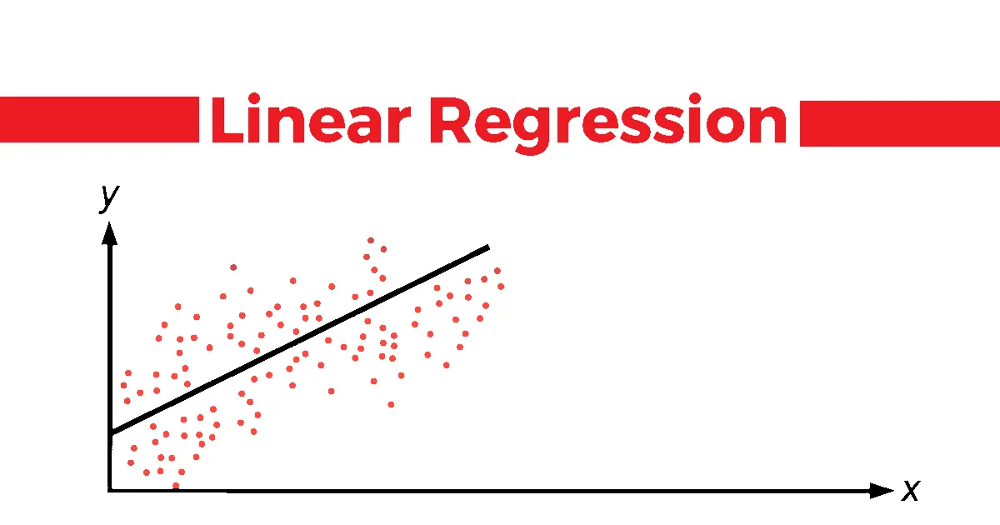

# Linear Regression

Linear Regression (LR) is a statistical supervised learning technique to predict the quantitative variable by forming a linear relationship with one or more independent features.

In simple terms, a basic model to solve the problem of Linear Regression (LR) has the following form:

$$
y = β₀ + β₁ * x₁ + ε
$$

Where:
- **$y$** is the dependent variable (the output or target).
- **$x₁$** is the independent variable (the input feature).
- **$β₀$** is the intercept.
- **$β₁$** is the slope or coefficient.
- **$ε$** is the error term.

For **multiple linear regression**, the equation looks like this:

$$
y = β₀ + β₁ * x₁ + β₂ * x₂ + ... + βₙ * xₘ + ε
$$

Where:
- **$y$** is the dependent variable (the output or target).
- **$x₁, x₂, ..., xₘ$** are the independent variables (the input features).
- **$β₀$** is the intercept.
- **$β₁, β₂, ..., βₘ$** are the coefficients for each corresponding feature.
- **$m$** is number of features
- **$ε$** is the error term.

## Linear Regression in Deep Learing

However, to simplify everything in the way Deep Learning (DL) works, we call **$βᵢ$** (with **$i$** from 1 to **$n$**) as **$wᵢ$** (weights), **$β₀$** as **$b$** (bias), and we assume **$ε$** equals 0. Essentially, at this point, we consider the Linear Regression (LR) model as a **Neural Network** with just one layer that contains **$wᵢ$** and **$b$** connecting the input and output **$y$**. In other words, our model now has the form:

$$
y = b + w₁ * x₁ + w₂ * x₂ + ... + wₙ * xₙ 
$$

In this tutorial, to solve a simple problem, our **$x$** will only have one dimension or in another words, we have only one feature. Therefore, our model will now have the form:

$$
y = w * x + b
$$

Where:

- **Weights (wᵢ)**: In DL, the coefficients **$βᵢ$** are often referred to as **weights** because they represent the strength of the connection between the input feature \(x_i\) and the output \(y\).
- **Bias (b)**: **$β₀$** is called **bias** in DL. The bias helps shift the output up or down, giving the model more flexibility to fit the data.
- **Assuming ε = 0**: In DL, we typically focus on learning the parameters (weights and bias), and the error term **ε** is assumed to be implicitly minimized through optimization techniques like gradient descent.
- **Neural Network Interpretation**: A Linear Regression model can be viewed as a single-layer neural network, where each input **x** is connected to the output **y** via the learned weights **w** and bias **b**.

In summary, when solving a simple LR problem with one input dimension. This corresponds to a neural network with one input, one output, and no hidden layers, which is effectively a linear mapping from input to output.

## Metric

To evaluate the effectiveness and optimize the model, we need something called a **loss function**. In the task of Linear Regression (LR), the commonly used loss function is called **Mean Squared Error (MSE)**. It calculates the square of the difference between the predicted value and the true value. The equation for MSE is:

$$
\text{MSE} = \mathcal{L}(y_i, \hat{y_i}) = \frac{1}{n} \sum_{i=1}^{n} (y_i - \hat{y_i})^2
$$

Where:
- **$n$**: The number of data points (or observations).
- **$y_i$**: The actual (true) value for the $i$-th data point.
- **$\hat{y}_i$**: The predicted value for the $i$-th data point.
- **$\Sigma$**: Summation over all the data points from $i = 1$ to $n$.
- **$(y_i - \hat{y}_i)$**: The difference between the actual and predicted values, also called the residual.
- **$(y_i - \hat{y}_i)^2$**: The square of the residual, which makes sure that positive and negative differences are treated equally.
- **$\frac{1}{n}$**: The average of all the squared residuals.

MSE gives us an overall measure of how well the model is performing. The lower the MSE, the better the model fits the data.

## Stochatic Gradient Decent

To optimize a function, or more simply in mathematical terms, to find a point where the output value of the function is minimized (or zero), we use an algorithm called **Stochastic Gradient Descent (SGD)**. Given the assumption that we have the function \( L = f(w) \), our task is to find the value \( w_0 \) such that \( L = f(w) \) is minimized.

The formula for the SGD algorithm is:

$$
w_{t+1} = w_t - \alpha \cdot \frac{dL}{dw}
$$

Where:
- **$ w_t $** is the current weight or parameter value at time step $t$.
- **$ \alpha $** (alpha) is the learning rate, which controls the step size of the update.
- **$\frac{dL}{dw} $** is the derivative (or gradient) of the loss function with respect to the weight $w$.

Initially, we randomly initialize the value of  $w_t$ and keep updating it until $w_{t+1}$ converges to a certain value, or until a pre-defined number of iterations $t$ is reached. The minus sign in the formula indicates that we are updating $w$ in the direction opposite to the gradient of the loss function $f(w)$. The magnitude of the update is determined by the learning rate $\alpha$. A small example of SGD will be demonstrated through sgd.py, with the function we will observe being $f(w) = w^2 +2*w -4$.

